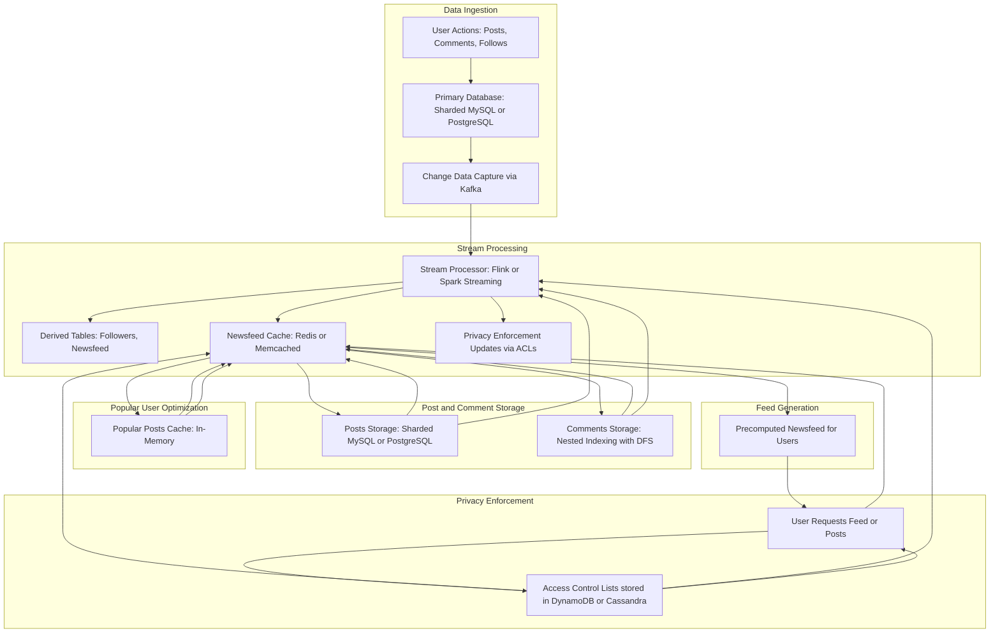

# Twitter, Facebook, Reddit, Instagram

Here's a detailed breakdown and system design post based on the transcript you provided. The content can be organized into multiple parts for easier understanding. Let me know if you'd like to proceed to the next part at any point.

---

### **Part 1: Overview and Features**
#### **Introduction**
This system design focuses on building four different yet similar platforms: Instagram, Twitter, Facebook, and Reddit. The aim is to support the following features efficiently:
1. **Newsfeed**: A low-latency, personalized feed for users.
2. **Nested Comments**: Reddit-style, tree-structured comments with "load more" functionality.
3. **Followers and Following**: Fast operations to retrieve followers and the users being followed.
4. **Configurable Privacy**: Support for different visibility levels for posts (e.g., "followers only" or "close friends").
5. **Read-Optimized Design**: Optimizing the system for frequent reads rather than writes, given user behavior trends.

---

### **Part 2: Requirements and Estimates**
#### **Capacity Estimates**
1. **Post Size**:
    - Approximate size per post: 200 bytes (100 bytes for text, 100 bytes for metadata like user ID and timestamp).
    - Daily posts: 1 billion → ~73 TB/year.
2. **Comments**:
    - Approximate size per comment: 200 bytes.
    - Up to 1 million comments per post → ~200 MB storage for a single post's comments.
3. **Followers**:
    - Average followers per user: ~100.
    - Some users (e.g., verified accounts) may have millions of followers.

#### **Primary Objectives**
1. Fast access to followers and following data.
2. Efficient storage and retrieval of posts and comments.
3. Minimize latency for the newsfeed.

---

### **Part 3: Followers and Following Implementation**
#### **Challenges**
- Queries like "Who follows me?" and "Who do I follow?" must be fast.
- A naïve design indexing only on one field (e.g., user ID for followers) results in distributed queries for the other operation.

#### **Solution: Derived Data with Change Data Capture (CDC)**
- **Primary Table**: Store user-follow relationships with the user's ID as the key.
- **Derived Table**: Generate a complementary table using CDC for fast "following" lookups.

#### **Workflow**
1. **Source of Truth Table**:
    - Example schema: `user_id | follower_id`.
    - Index and partition on `user_id` for quick follower lookups.
2. **CDC and Stream Processing**:
    - Use tools like Kafka (for fault-tolerant, replayable logs) and Flink (for stateful stream processing) to update derived data tables.
3. **Derived Data Table**:
    - Complementary schema: `follower_id | user_id`.
    - Indexed and partitioned on `follower_id`.

#### **Database Choice**: Cassandra
- **Advantages**:
    - Leaderless replication for fast writes.
    - Log-structured merge (LSM) trees for efficient ingestion.
    - Partitioning by `user_id` ensures all follower data for a user resides on a single node.

---

### **Part 4: Optimizing Newsfeed**
#### **Naïve Approach**
1. Retrieve a user's following from the derived table.
2. Query all their posts from a sharded database.
3. Aggregate posts and return them to the user.

**Problem**: High latency due to distributed queries and aggregation.

#### **Optimized Approach**
1. **Fan-Out on Write**:
    - When a user posts, distribute the post to the newsfeeds of all their followers.
    - Store these pre-computed feeds in memory for fast retrieval.
2. **Handling Popular Users**:
    - Posts from verified users with millions of followers are aggregated in a shared "popular posts" cache.

#### **Workflow**
- **Post Creation**:
    - Use CDC to stream post updates to Flink.
    - Flink identifies followers and updates their respective feed caches.
- **Feed Caches**:
    - Partitioned by `user_id` and stored in memory for fast reads.

---

### **Part 5: Nested Comments**
#### **Challenges**
- Comments form a tree structure.
- Efficiently fetching branches or levels of the tree is essential.

#### **Solution: Depth-First Search (DFS) Index**
1. **Indexing**:
    - Each comment is assigned an ID based on its path in the tree (e.g., `A`, `AA`, `AB`).
    - Perform range queries to retrieve branches (e.g., all IDs between `A` and `AB` for a subtree).
2. **Database Choice**:
    - Use MySQL with single-leader replication to ensure consistent reads and writes.

---
### **Part 6: Configurable Privacy**

#### **Challenge**
Platforms like Instagram, Facebook, and Twitter allow users to set privacy levels on posts (e.g., "followers only," "close friends," or "public"). The system must enforce these privacy levels while ensuring low-latency reads for posts and newsfeeds.

#### **Solution: Access Control Lists (ACLs)**

##### **1. Storing ACLs**
Each post is associated with an ACL, which is used to determine its visibility:
- **Schema Example**:
  ```plaintext
  post_id | acl_type      | acl_data
  ----------------------------------
  123     | FOLLOWERS     | [user_1, user_2, user_3]
  124     | CLOSE_FRIENDS | [user_4, user_5]
  125     | PUBLIC        | []
  ```
    - `acl_type`: Specifies the type of visibility (e.g., "FOLLOWERS," "CLOSE_FRIENDS," or "PUBLIC").
    - `acl_data`: Contains additional user IDs if the visibility is limited (e.g., "CLOSE_FRIENDS").

##### **2. Enforcing ACLs**
- **During Newsfeed Generation**:
    - While precomputing the newsfeed, ACLs are checked to ensure only eligible users receive the post.
    - For example, when a "CLOSE_FRIENDS" post is created, only users in the `acl_data` list have the post added to their newsfeed.

- **During Ad-Hoc Reads**:
    - If a user directly requests a post (e.g., visiting a profile), the ACL is validated before returning the post.

##### **3. Database Choice**
Use a NoSQL database like **DynamoDB** or **Cassandra** to store ACLs:
- Partition by `post_id` for quick lookup during newsfeed generation or direct reads.

---

### **Part 7: Popular User Optimization**

#### **Challenge**
Popular users (e.g., celebrities) have millions of followers, which makes fan-out on write (pushing their posts to all followers) impractical due to:
1. High latency in updating millions of feed caches.
2. Huge storage overhead in newsfeed tables.

#### **Solution: Pull-Based Fan-Out for Popular Users**
1. **Cache Popular Posts Separately**:
    - Popular users' posts are stored in a **global cache** accessible by all users.
    - Followers fetch these posts dynamically during feed generation.
2. **Hybrid Newsfeed**:
    - For regular users, posts are pushed to the followers' newsfeed caches (fan-out on write).
    - For popular users, posts are pulled from the global cache (fan-out on read).

#### **Workflow**
- **Regular Users**:
    - When a regular user creates a post, it’s added to their followers' precomputed feeds.

- **Popular Users**:
    - Posts are added to a shared "popular posts" cache.
    - During feed generation, this cache is queried dynamically.

---

### **Part 8: System Diagram and Final Workflow**

Here’s a high-level architecture for the system:

#### **1. Components**
- **Data Ingestion**:
    - User actions (posts, comments, follows) are written to a primary database.
    - CDC tools like Kafka capture these events for downstream processing.

- **Stream Processing**:
    - Tools like Flink or Spark Streaming process the data to update derived tables (e.g., followers, feeds).

- **Feed Storage**:
    - Newsfeeds are stored in a distributed in-memory store (e.g., Redis or Memcached) for fast access.

- **Post and Comment Storage**:
    - Posts and comments are stored in scalable, sharded databases like MySQL or PostgreSQL.
    - Comments are indexed hierarchically for efficient nested retrieval.

- **Privacy Enforcement**:
    - ACLs are stored in a NoSQL database and validated during reads or newsfeed generation.

---

#### **2. Workflow**
1. **Post Creation**:
    - User posts trigger a CDC event.
    - Followers are identified and their feeds are updated.
    - ACLs are enforced to determine visibility.
2. **Newsfeed Fetch**:
    - User requests their feed.
    - Feed is fetched from in-memory storage, and popular posts are pulled dynamically.
3. **Comment Retrieval**:
    - Nested comments are fetched using DFS-based indexing.

---


